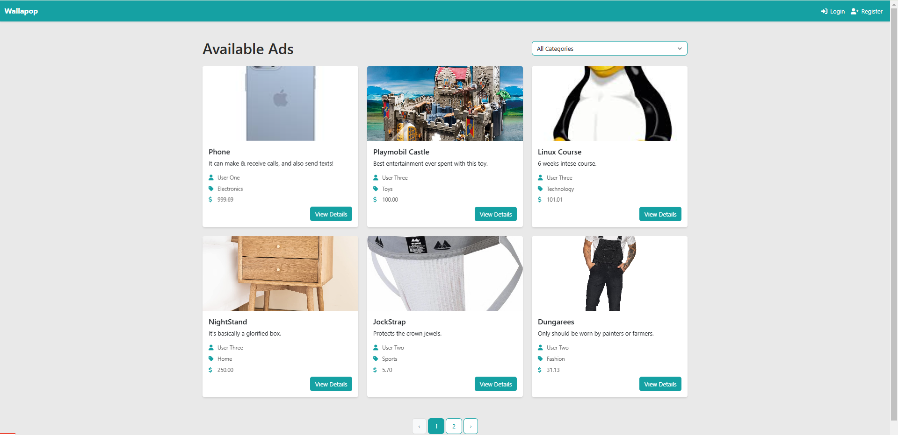
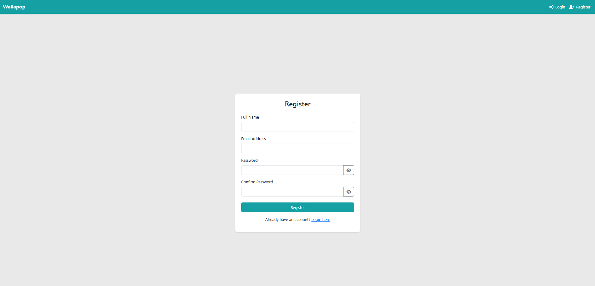
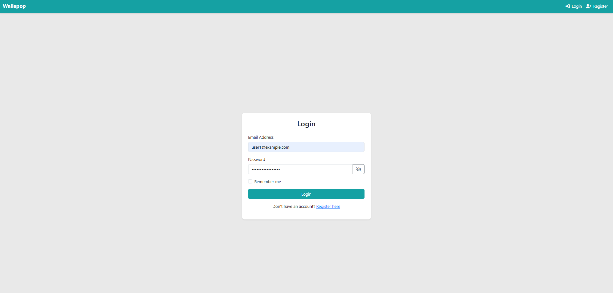
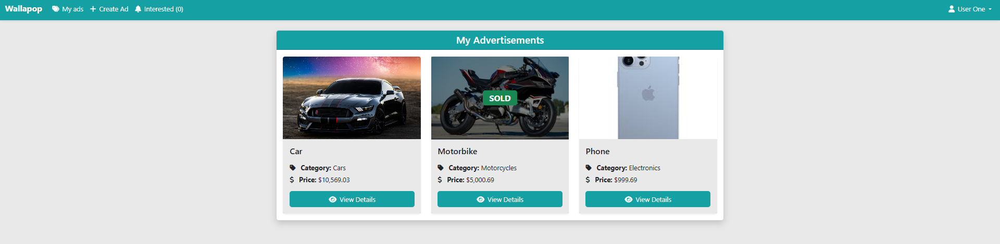
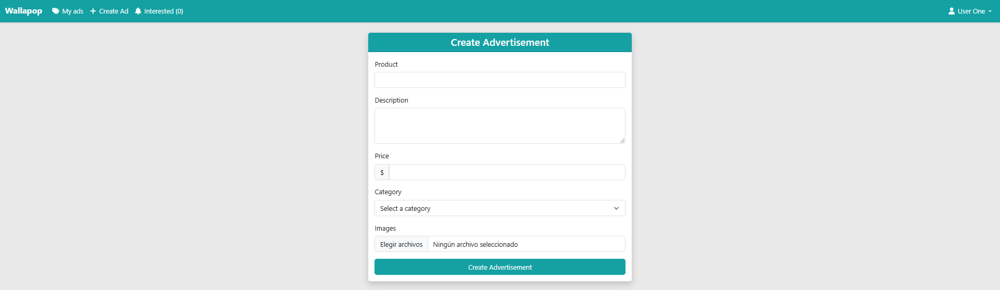
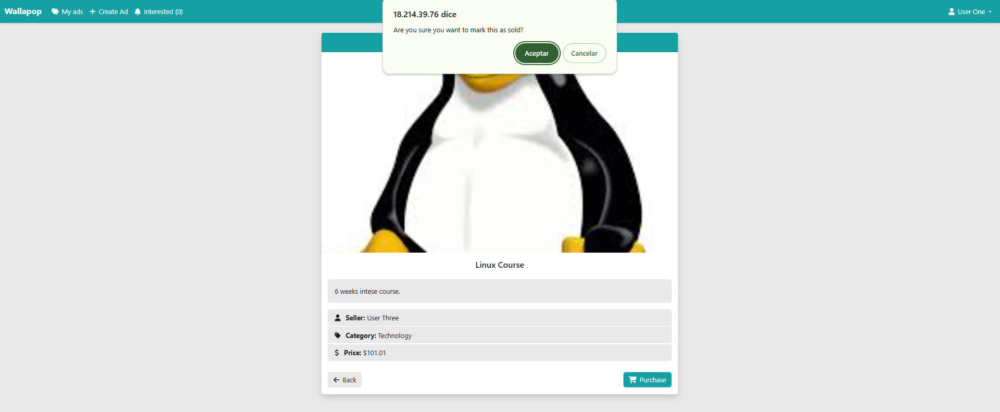
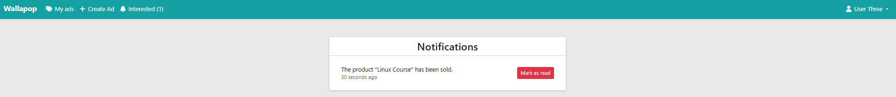

# Wallapop

## Home pagged before loggin in

When not logged in, you can see all of the adds without filters.

When logged in, you can see all of the adds with filters through categories.

## Register page for a new user

## Login page for a already registered user

## Personal User's adds

## Create Add page with all categories

## Purchase pop-up window to verify purchase of an add

## Notification page for when someone has bought a user's add

